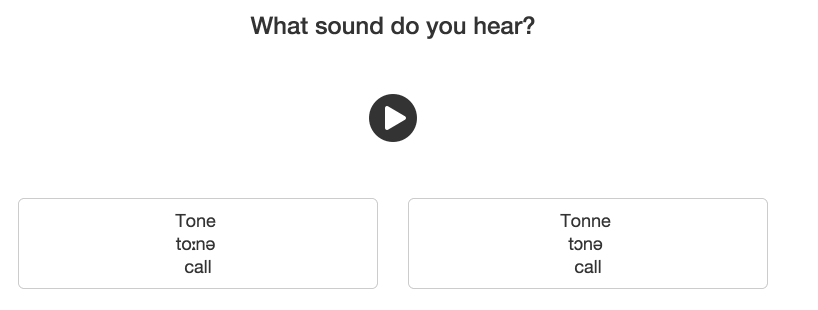

Learning a new language has many well-researched benefits.
This year, I've set aside time to learn German and build more projects in public.
And this month, I'm launching a new website that achieves both goals: [Noob German](https://noobgerman.com/) (more on this later).

Here are seven scientifically-backed lessons to help learn a new language.

<h3>
1. You're not too old
</h3>

   Prevailing wisdom said that only children's flexible brains could learn a new language.
   As recently as [2009](http://onlinelibrary.wiley.com/doi/10.1111/j.1467-9922.2009.00507.x/abstract), researchers found that adult learners almost never attain fluency.

   </img>

   Thankfully, if you're learning a language as an adult, you're not out of luck!
   A [2011 study](http://www.newscientist.com/article/mg21128224.000-age-no-excuse-for-failing-to-learn-a-new-language.html) showed that adult learners were better at learning new grammar patterns.
   More recently, professors from [UIC and Georgetown](http://journals.plos.org/plosone/article?id=10.1371/journal.pone.0032974) demonstrated that adults can retain this knowledge even after several months not speaking the language.

<h3>
2. Plan a trip
</h3>

  Duolingo sponsored an [independent report](http://static.duolingo.com/s3/DuolingoReport_Final.pdf) to measure their app's effectiveness.
  The app is incredibly valuable: 26-49 hours of Duolingo practice works as well as a first college semester Spanish course.

  The study quantifies how the reason for learning a new language affects success.
  Studying for personal interest shows the worst improvement for each hour of study despite being the most common motivator.
  The most effective motivator? Studying for travel.
  Students motivated by a trip learn more than three times as much per hour of study.

  </img>

  If you're looking to learn a language, nothing lights a fire in your belly like an upcoming trip to Oktoberfest or Carnival.

<h3>
3. Chinese characters vs. English words
</h3>

   English speakers learning Chinese or another [logographic](http://en.wikipedia.org/wiki/Logogram) language need a lot of patience.
   Even native speakers acquire these languages differently.

   For example, a study of education systems published in 1992 ([PDF link](http://www.cogsci.ucsd.edu/~deak/classes/EDS115/Stevenson_Stigler_1992.pdf)) considers how grade school learners read above their grade level.
   They find that more students in Beijing enter first grade above expected reading levels compared to students in Chicago.
   But, the percentage of Beijing students reading above grade level quickly falls to 0, while many Chicago students continue outperforming:

   

   This makes sense: logographic languages don't have words that can be decoded into familiar parts.
   If you're learning an alphabetic language like English or German, you can infer vocab from simpler words.
   For example, knowing "birth" ("Geburt") and "day" ("Tag") means you've already learned "birthday" ("Geburtstag").
   Logographic language learners don't have these helpful cues.

<h3>
4. Speaking is fundamental
</h3>

   Depending on your goals, learning to speak a language generally reaps more tangible results than learning to read.
   It doesn't matter how many words you can read on the menu if you just want to order dinner!
   Studies on poor readers across languages prove this point.

   The [latest research](http://www.tandfonline.com/doi/abs/10.1080/10888438.2012.689787#.VOIrm7DF84Q) shows that ineffective foreign language readers have two main problems.
   First, they lack **morphological awareness**, the ability to identify word parts that are significant (like the Chicago grade schoolers decoding new vocab).
   Second, they underperform in **phonological awareness**, hearing the sounds that make up words.

   Diligently studying words' components and sounds can accelerate learning.
   Importantly, both of these issues can be corrected by focusing on proper speaking, which forces a student to break down words into constituent parts and sound them out correctly.

<h3>
5. Find a constructive teacher
</h3>

   A [recent paper](http://www.sciencedirect.com/science/article/pii/S0346251X13001905) studies students' journal entries to understand how teachers affect willingness to communicate (WTC) in a new language.
   The students were a group of 50 undergrads who were required to write focused essays on their classroom conversations.
   Students generally felt more comfortable speaking a language if the teachers were patient when waiting for answers, let the students choose conversation topics, and did not immediately correct problems.

   In contrast, when teachers did not show patience, the students became obsessed with mistakes:

   >  It is very unpleasant to hear the correct grammatical form or pronunciation when you are speaking in the classroom...I decided to speak when I am sure about the accuracy of sentence I'm going to say.

   The students with the strongest WTC viewed the teachers more like friendly partners who "help you to deliver your message by providing explanations."
   Finding language learning partners (via a service like [Cambly](https://www.cambly.com/)) and using software that provides this kind of feedback can be more effective than classroom language learning.

<h3>
6. Seek explicit feedback
</h3>

   Have you ever tried to learn something when a teacher simply repeats the correct answer?
   This can be frustrating, especially when trying to pick up something subtle like an unexpected sound or vocab word.

   <iframe class="block-center" width="420" height="315" src="https://www.youtube.com/embed/kTcRRaXV-fg?start=90" frameborder="0" allowfullscreen></iframe>

   Three researchers from New Zealand [studied this problem](http://dx.doi.org/10.1017/S0272263106060141) with students learning the English past tense.
   Not surprisingly, simply repeating the correct answer when students make mistakes is ineffective.
   Students do a far better job learning the past tense rules when they are explicitly corrected (e.g. "you need the *-ed* past tense ending here").

   Seek out this explicit feedback when learning a language.
   It's a much faster way to improve and retain new information.

<h3>
7. Train your ear
</h3>

   Pronunciation is the key to success for learning a new language.

   One of the most studied pronunciation topics is how English speakers learn the difference between the *l-* and *r-* sounds as in "lock" and "rock" or "load" and "road".
   Researchers at Carnegie Mellon dove into this problem in a [2002 paper](http://psych.stanford.edu/~jlm/papers/McCFiezMcCandliss02.pdf).
   The researchers had Japanese adults listen to a recording of "lock" or "rock" at random and then select the sound they heard.
   Although their initial performance was poor, it increased to 80% accuracy when the subjects received immediate feedback on wrong answers.
   More importantly, these subjects became better at distinguishing other English words and speaking correctly after the training.

   My buddy [Andy Jiang](http://www.andyjiang.com/) and I built [Noob German](https://noobgerman.com/) based on this research.
   Noob German is a simple flash card trainer for anyone learning German.
   Each flash card plays a German sound and you are asked to select from two options.

   </img>

   This pronunciation training kick starts your German learning.  Check out [Noob German](https://noobgerman.com/) and please let us know your thoughts [@NoobGerman](https://twitter.com/noobgerman).

<!--
see citations in "Second Language Learning Theories"
for 3:
 are learned fundamentally differently (https://www.dropbox.com/s/hwt4ujm8n993yk8/Screenshot%202015-02-17%2020.49.58.png?dl=0)
"Writing and Literacy in Chinese, Korean and Japanese" and http://www.cogsci.ucsd.edu/~deak/classes/EDS115/Stevenson_Stigler_1992.pdf
4. Something about recognizing asian alphabets
http://i.imgur.com/aYcZks1.png
"Bilingual Development and Literacy Learning"

http://earlyliteracylearning.org/cellreviews/cellreviews_v6_n2.pdf
By studying a group of native Spanish speakers who learned Swedish as children, they showed that no one who learned the new language after the age of 12 spoke like a true native.
-->
