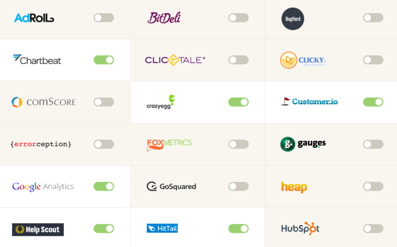

[Segment](https://segment.com/) is a customer data hub that makes it easy for websites and mobile apps to integrate 3rd-party analytics tools.
With all the customer data already flowing through them, Segment is opening a powerful distribution channel for data-powered SaaS businesses.

</img>

Full disclosure &mdash; I'm close with the Segment team and they were customers of my company [StackLead](https://stacklead.com/).
I think they're poised to win with:
an [incredible team](http://www.forbes.com/pictures/mll45kfhf/calvin-french-owen-25-ian-storm-taylor-25-llya-volodarsky-24-peter-reinhardt-25/) with [serious fundraising](http://www.forbes.com/sites/benkepes/2014/10/08/segment-raises-15m-for-a-customer-data-hub/),
[huge](https://github.com/segmentio/analytics.js) [open-source](https://github.com/segmentio/myth) [contributions](https://github.com/segmentio/nightmare),
and a number of important enterprise customers like Nokia and Live Nation.
Everything in this post uses public data.

### Crawling for Customer Trackers

I analyzed the [Crunchbase Data Export](https://info.crunchbase.com/about/crunchbase-data-exports/) from December 2, 2014.
First, I filtered this data down to the 20,186 companies that have raised more than $1m USD in funding and are still operating.
Then, I crawled all of the company websites to identify the SaaS trackers they had installed.&nbsp;[1]

Across this set of companies, there were 895 distinct trackers (e.g.&nbsp;analytics tools, web bugs, and ad pixels) and each company used **3&nbsp;trackers** on average.
Traditionally, installing each of these trackers is painful, error-prone work that's pretty boring for programmers.
The Segment platform suddenly makes it possible to integrate precise tools for parts of sales, marketing, customer success, etc. without wasting valuable engineering time.

### The Tracking Landscape

First, I looked at the number of companies that installed each of the top 10 data trackers, along with the percentage of those companies that also integrated Segment.
The top trackers are mostly free tools, so they scale for consumer products that are less likely than B2B companies to need customer-level tracking.

Google Analytics dominates &mdash; nearly 13,000 companies (63% of the dataset) use the popular service, but only 224 companies in this group (2%) are also Segment customers.

The next 10 most popular trackers include a number of paid analytics and marketing automation products.

Datapoints that jump out:
1. **Marketo and Pardot**: Only 2% of Marketo customers and 1% of Pardot customers also use Segment.
Companies that use these services are willing to pay a premium and Segment's biggest opportunity is selling into large enterprises with big integration issues.
2. **Mixpanel, Olark, and KISSmetrics**: These are approachable tools that lots of startups love.
   Segment has a solid 12-17% penetration with their customer base.

### Drilling down by Funding

Segment has the greatest penetration with earlier-stage companies ($1&#8209;3mm in funding) and obviously has a big opportunity to move upmarket.
Also, as these smaller companies grow, Segment is well-positioned to cater to their expanding customer data needs.

### Drilling down by Market

The next chart shows data for the top 10 markets, sorted based on the average number of trackers used by the companies in each market.

We see an interesting correlation: as the number of trackers per company decreases (from 6.1 for the average e-commerce website to 1.0 for biotech), Segment's penetration in the market also goes down.
Segment is increasingly valuable for industries that spend engineering effort on implementing trackers.
Importantly, these are high-growth industries like e-commerce and enterprise software that are looking to adopt new SaaS solutions.

### How Segment is Changing the SaaS Marketplace

Segment's biggest impact is unprecedented distribution for new analytics tools and trackers.
For companies like [Customer.io](http://customer.io/) and [Amplitude](https://amplitude.com/), 2/3 of their customers are also Segment users.
Here are the trackers with the highest percentage of customers using Segment:

Previously, integration pains were a huge barrier for new SaaS products to gain traction.
Segment is well-positioned to solve this problem and make it extremely easy for businesses (from startups to large enterprises) to mix and match their ideal customer data setup.

[1] You can use a tool like [Ghostery](https://www.ghostery.com) to manually view the trackers on a site you're browsing.
